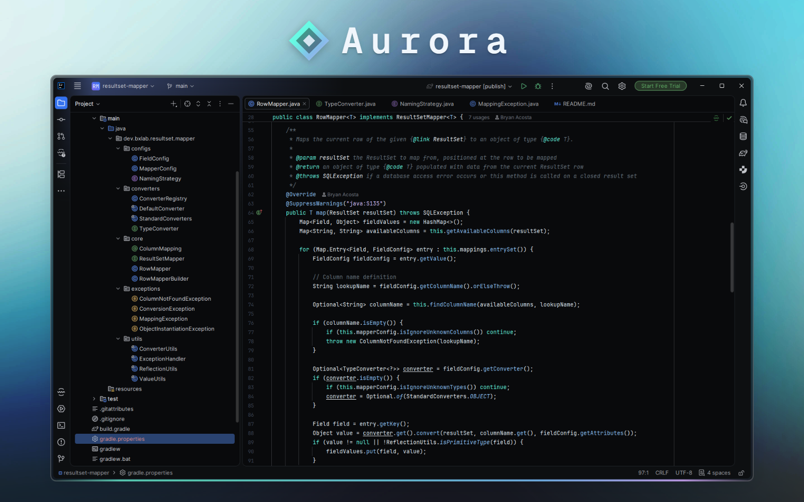

# Aurora

A minimalistic dark theme with clean syntax highlighting for JetBrains IDEs.



## Compatibility

Requires a JetBrains IDE **2025.3 or newer** (build `253`+), where the Islands layout is available.

## Installation

### From disk

Download the latest `.zip` from the [Releases](../../releases) page (or build it locally, see below), then
**Settings | Plugins | ⚙ | Install Plugin from Disk…** and pick the ZIP.

After installing, open **Settings | Appearance & Behavior | Appearance** and select *Aurora*.

## Development

Build the distributable ZIP (generated in `build/distributions/`):

```bash
./gradlew buildPlugin
```

Run a sandbox IDE with the theme preinstalled:

```bash
./gradlew runIde
```

## Inspiration

This theme was inspired by the following projects:

- [Poimandres JetBrains](https://github.com/marko-mihajlovic/poimandres-jetbrains)
- [JetBrains GitHub Dark Theme](https://github.com/toby-j/jetbrains-github-dark-theme)
- [One Dark JetBrains Theme](https://github.com/one-dark/jetbrains-one-dark-theme)

## License

This project is licensed under the [MIT License](LICENSE).
